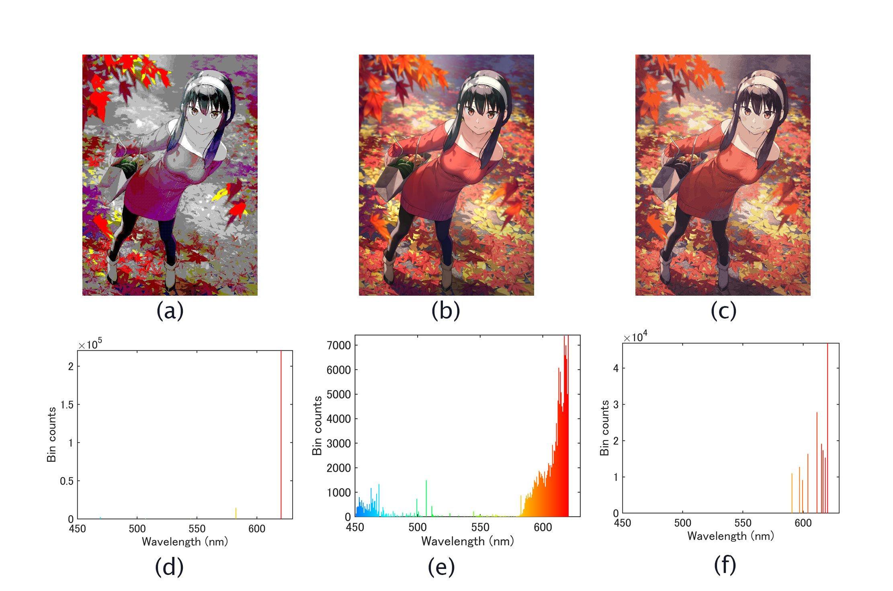
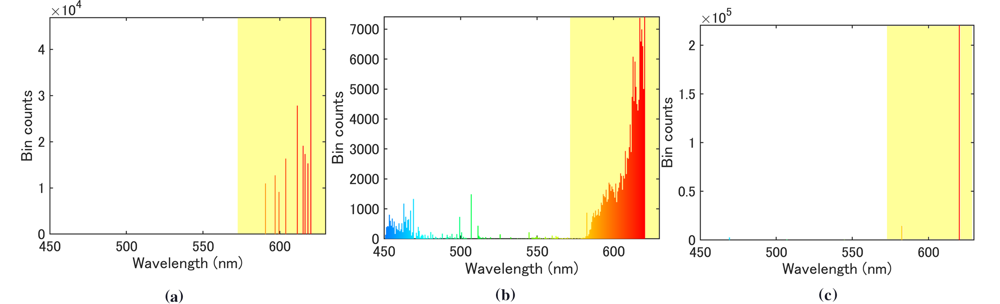
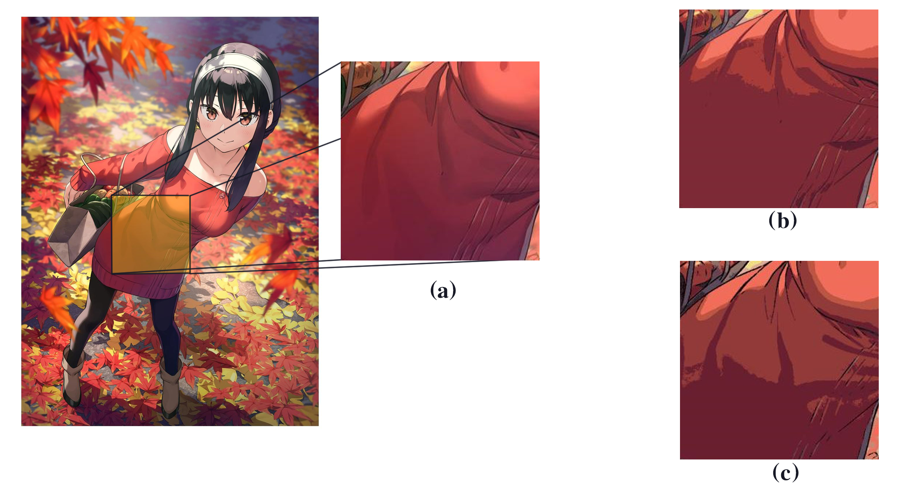

# color_quantization

 <strong>(a)</strong> original image <strong>(b)</strong>  Window style 4-bit color space <strong>(c)</strong>  k-means cluster <strong>(d)</strong>  k-means after abstration

## Introduction

**Color quantization** is an image-compressed method aiming at converting an image with wide color variances
to a relatively condensed color space without unacceptable distortion. The clustering-based quantization
could provide high-quality results compared to conventional methods while bringing out obvious artifacts when dealing with gradients. Alleviation to the artifacts requires a structural understanding
of the image. Meanwhile, computational complexity and quality are always a trade-off. In this repo, a
flow-based image abstraction operation is proposed to anti-artifact.
Proposing the flow-based image abstraction before clustering tames the color variation and introduces continuous
adjacent edges to increase the quantization quality. The quantization pipeline consists of two parts, the stage
of abstraction and k-means clustering. This method functions especially well on animation-style images.

## Color Quantization

An intuitive understanding of what is color quantization could be conveyed by playing with the brilliant work from [crapola/ColorQuantizer](https://github.com/crapola/ColorQuantizer), which containing an old school windows style pallete. By conparing the primitive windows 16 color(4-bit) with reletively modern cluster method,  it's apperantlt that an image-basing method is way more better in representing the original image.

<strong>(a)</strong>
  image in 4-bit
<strong>(b)</strong>
  Window style 4-bit color space 
<strong>(c)</strong>
  original image
<strong>(d)</strong>
  color space thrived by k-means
<strong>(e)</strong>
  image in cluster-pallate
 

 There are two kinds of methods for creating color
palette: image-independent methods and image-dependent
methods [[1]](#1).Image-independent methods determine a generic palette without considering the contents of a particular image.
Image-dependent methods generate palettes based on the color of the given image. Image-independent methods are faster, but often produce poorer results because image-independent methods do not take image content into account. To illustrate the reason of the phenomenon, it is incisive in the facet of spectrum. 

<strong>(a)</strong>
  image in 4-bit
<strong>(b)</strong>
  original image
<strong>(c)</strong>
  clustered color space 
<strong>(d)-(f)</strong>
  spectrum of images above
 

The process of color quantization could be an analogy of sampling on the spectrum of the given image. It is obvious that with limited numbers of sample, the more you concentrate on the dense area of the spectrum, the result would turn out better.

Futhermore, considering to the signal processing, if the sample rate reachs the **Nyquist frequency**, it is safely to say that it is free of distortion.

$$f_s \geq 2f_{max}$$

 Apperantly, the cluster method definetely functions better on the images connote dense specturm area like "秋ヨル"[[2]](#2). 

<strong>(a)</strong>
  Specturm : Window style 4-bit color space 
<strong>(b)</strong>
  Specturm : original image
<strong>(c)</strong>
  Specturm : clustered image
 

This is because rather than sampling all the domain of spectrum averagely, the image-dependent method could locally increase the sample rate at dense part and take the rest as trade-off. In fact, for human's eye, the predominant part of spectrum convey details copious enough to transmit main infomation or stucture of the given images. 

## Image abstruction

The necessity of introducing Image absruction to the color quantization is primitive clustering method is unfunctional when processing at gradient. 

<strong>(a)</strong>
  Specturm : Window style 4-bit color space 
<strong>(b)</strong>
  Specturm : original image
<strong>(c)</strong>
  Specturm : clustered image
 

## References

 X.D. Yue, D.Q. Miao, L.B. Cao, Q. Wu, and Y.F. Chen. An efficient color quantization based on generic roughness measure. Pattern Recognition, 47(4):1777–1789, 2014.

<a id="2">[2]</a> Kantoku. 秋ヨル. Pixiv, 2022. https://www.pixiv.net/artworks/102451562.

## Afterwords