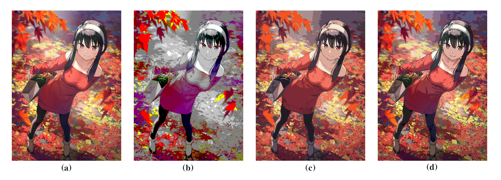
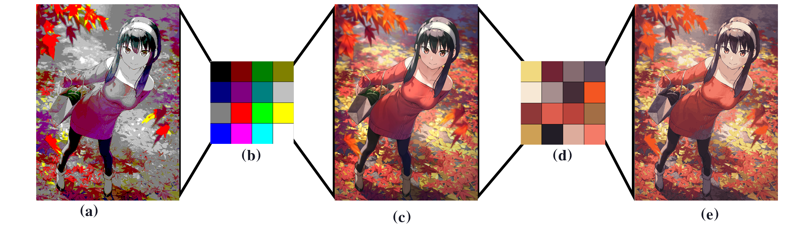

# color_quantization

 <strong>(a)</strong> original image <strong>(b)</strong>  Window style 4-bit color space <strong>(c)</strong>  k-means cluster <strong>(d)</strong>  k-means after abstration

**Color quantization** is an image-compressed method aiming at converting an image with wide color variances
to a relatively condensed color space without unacceptable distortion. The clustering-based quantization
could provide high-quality results compared to conventional methods while bringing out obvious artifacts when dealing with gradients. Alleviation to the artifacts requires a structural understanding
of the image. Meanwhile, computational complexity and quality are always a trade-off. In this repo, a
flow-based image abstraction operation is proposed to anti-artifact.
Proposing the flow-based image abstraction before clustering tames the color variation and introduces continuous
adjacent edges to increase the quantization quality. The quantization pipeline consists of two parts, the stage
of abstraction and k-means clustering. This method functions especially well on animation-style images.

An intuitive understanding of what is color quantization could be conveyed by playing with the brilliant work from [crapola/ColorQuantizer](https://github.com/crapola/ColorQuantizer), which containing an old school windows style pallete. By conparing the primitive windows 16 color(4-bit) with reletively modern cluster method,  it's apperantlt that an image-basing method is way more better in representing the original image.
