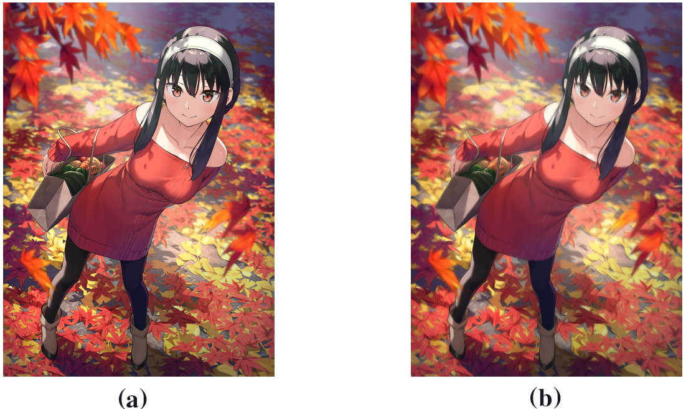

# color_quantization

 <strong>(a)</strong> original image <strong>(b)</strong>  Window style 4-bit color space <strong>(c)</strong>  k-means cluster <strong>(d)</strong>  k-means after abstration

## Introduction

**Color quantization** is an image-compressed method aiming at converting an image with wide color variances
to a relatively condensed color space without unacceptable distortion. The clustering-based quantization
could provide high-quality results compared to conventional methods while bringing out obvious artifacts when dealing with gradients. Alleviation to the artifacts requires a structural understanding
of the image. Meanwhile, computational complexity and quality are always a trade-off. In this repo, a
flow-based image abstraction operation is proposed for anti-artifact.
Proposing the flow-based image abstraction before clustering tames the color variation and introduces continuous
adjacent edges to increase the quantization quality. The quantization pipeline consists of two parts, the stage
of abstraction and k-means clustering. This method functions especially well on animation-style images.

## Color Quantization

An intuitive understanding of what color quantization could be conveyed by playing with the brilliant work from [crapola/ColorQuantizer](https://github.com/crapola/ColorQuantizer), which contains an old-school windows style palate. By comparing the primitive windows 16 color(4-bit) with the relatively modern cluster method,  it's apparent that an image-basing method is way better at representing the original image.

<strong>(a)</strong>
  image in 4-bit
<strong>(b)</strong>
  Window style 4-bit color space 
<strong>(c)</strong>
  original image
<strong>(d)</strong>
  color space thrived by k-means
<strong>(e)</strong>
  image in cluster-palate
 

 There are two kinds of methods for creating color
palette: image-independent methods and image-dependent
methods [[1]](#1).Image-independent methods determine a generic palette without considering the contents of a particular image.
Image-dependent methods generate palettes based on the color of the given image. Image-independent methods are faster, but often produce poorer results because image-independent methods do not take image content into account. To illustrate the reason for the phenomenon, it is incisive in the facet of the spectrum. 

<strong>(a)</strong>
  image in 4-bit
<strong>(b)</strong>
  original image
<strong>(c)</strong>
  clustered color space 
<strong>(d)-(f)</strong>
  the spectrum of images above
 

The process of color quantization could be an analogy of sampling on the spectrum of the given image. It is obvious that with limited numbers of sampling, the more you concentrate on the dense area of the spectrum, the result would turn out better.

Furthermore, considering the signal processing, if the sample rate reaches the **Nyquist frequency**, it is safe to say that it is free of distortion.

$$f_s \geq 2f_{max}$$

 The cluster method functions better on images that connote dense spectrum areas like "秋ヨル"[[2]](#2). 

<strong>(a)</strong>
  Spectrum: Window style 4-bit color space 
<strong>(b)</strong>
  Spectrum: original image
<strong>(c)</strong>
  Spectrum: clustered image
 

This is because rather than sampling all the domains of the spectrum averagely, the image-dependent method could locally increase the sample rate at the dense part and take the rest as a trade-off. In fact, for the human eye, the predominant part of the spectrum conveys details copious enough to transmit the main information or structure of the given images. 

## Image abstraction

The necessity of introducing Image abstraction to the color quantization is primitive clustering method is unfunctional when processing at a gradient. 

<strong>(a)</strong>
  Original image
<strong>(b)</strong>
  primitive cluster
<strong>(c)</strong>
  cluster after abstraction 
 

From the contrary of **(b)** and **(c)** can tell that the primitive cluster method sometime might divide the gradient part into two discrete different colors and generate obvious artifacts in the vicinity of two color zone. To some point, this might be an inevitable problem because the limited color(16 in this example which is an intense compress) is unable to represent the full information in nature. That is the exact reason why it is necessary to import the image abstraction method to the color quantization task. When the breakdown of the gradient part is inevitable, at least it could turn out a continuous edgy rather than a jagged artifact.

Using a shape/color filtering guided by a vector field that describes the flow of salient features in the image could significantly abstract the main structural information from the image and enact it as pre-process for the cluster followed. 
$$  t^{'}(x)=\frac{1}{k}\sum_{\Omega_{\mu}}{\phi(x,y)t(y)w_{s}(x,y)w_{m}(x,y)w_d(x,y)dy}$$
where $\Omega_{\mu}$ denotes the kernel of radius at x, and $k$ is the
vector normalizing term. The tangent vector $t(\cdot{})$ is assumed
to be $2\pi$-periodic.[[2]](#2)

$$
         w_s(x,y) = \left\{ \begin{array}{cl}
                    1 & :  \textbf{if} \quad |x-y|<\mu \\
                    0 & : \textbf{otherwise}
                    \end{array} \right.
$$

The above function defines the **spacial weight function** $\omega_s$. A box filter is applied to the total filter.

 $w_m$ and $w_d$ are key weights that mean magnitude weight function and direction weight functions individually.

$$
    \begin{array}{cl}
        w_m(x,y) & = \frac{[\hat{g}(y)-\hat{g}(x) + 1]}{2}\\
        w_d(x,y) & =|t(x)\cdot t(y)|
        \end{array}
$$

<strong>(a)</strong>
  Original image
<strong>(b)</strong>
  abstracted image
 

 The abstracted image is like to be blurred by a gaussian filter but unlike gaussian, this abstraction method can construct a continuous edge to improve the quality of clustering.

## References

<a id="1">[1]</a> X.D. Yue, D.Q. Miao, L.B. Cao, Q. Wu, and Y.F. Chen. An efficient color quantization based on generic roughness measure. Pattern Recognition, 47(4):1777–1789, 2014.

<a id="2">[2]</a> Kantoku. 秋ヨル. Pixiv, 2022. https://www.pixiv.net/artworks/102451562.

<a id="3">[3]</a> Henry Kang, Seungyong Lee, and Charles K. Chui. Flow-based image abstraction. IEEE Transactions on
Visualization and Computer Graphics, 15(1):62–76, 2009.

## Afterwords